# Carros de Combate
## Objetivo
El objetivo de esta demo es crear un equipo de agentes inteligentes (tanques) que compartan información, se sincronicen sin la necesidad de una IA multinivel, y supongan un reto entretenido para el jugador.
---
## El mapa
Hemos creado un par de mapas sencillo con cubos, tanto por estética como por rendimiento de los raycast. Al ser un entorno tan sencillo, podemos ser más laxos a la hora de utilizar raycast.

Tendremos muros (cobre) que actúan como obstáculos y fosos (azules) que impiden el movimiento pero permiten disparar por encima de ellos.

Ambos mapas cuentas con un NavMesh para que los tanques puedan desplazarse sin problema.

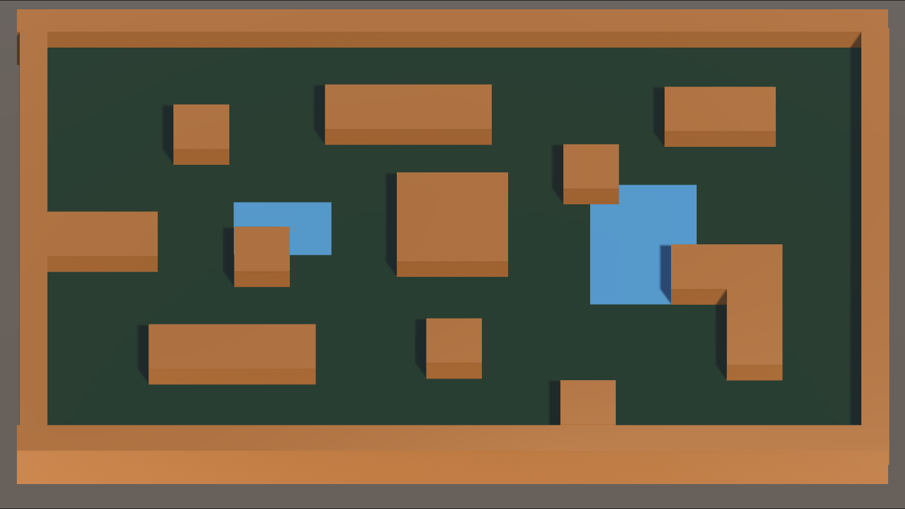
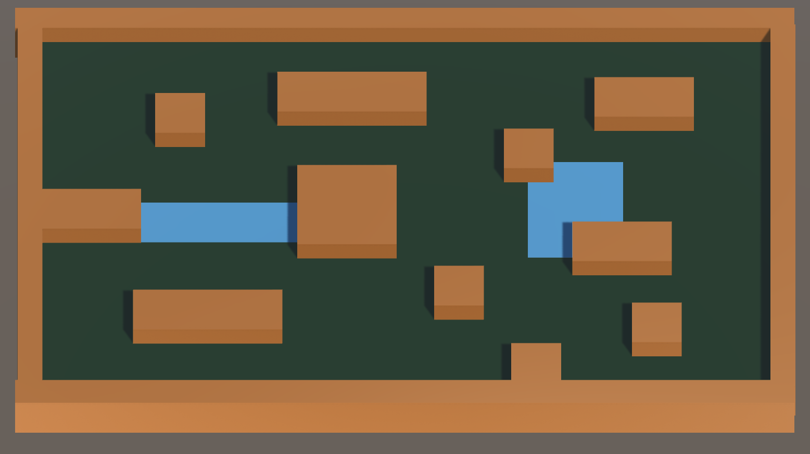

---

## El equipo
Todos los comportamientos están implementados mediante árboles de comportamiento ajustados a sus personalidades.

### El espía
A la hora de flanquear, calcularemos el centro del resto del equipo, aunque podemos excluir a ciertos miembros. Esto significa que a mayor escala podríamos tener varios espías que para este cálculo de flanqueo sólo toman en cuenta a los soldados. 

Tras calcular el centro del equipo con la información que nos proporcionan, elegiremos un punto en dirección opuesta desde donde estemos escondidos (no haya línea de tiro). Seleccionando GameObject del espía, en la vista de escena tendremos visión de la información de dónde se va a esconder.
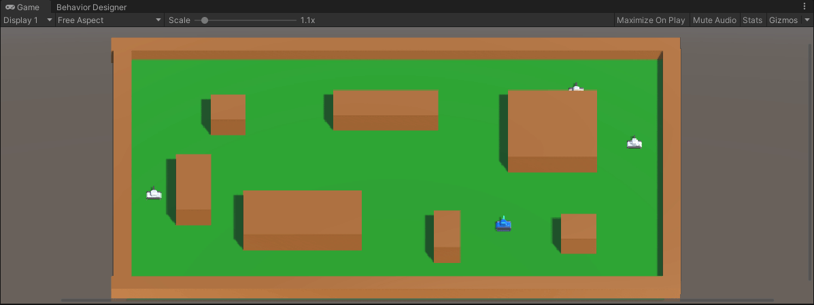
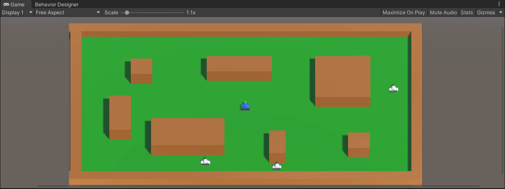
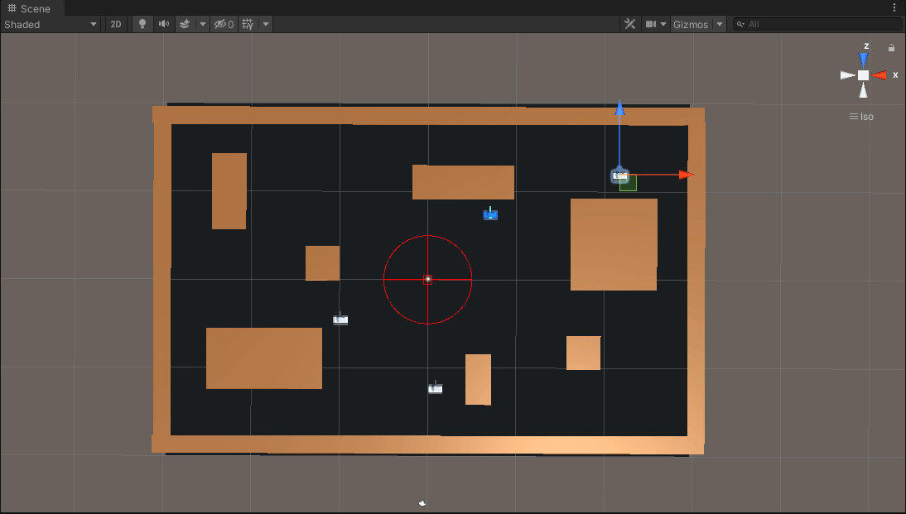

### El soldado
El soldado es una unidad de apoyo y, como tal, se intentará mantener cerca del jugador (sin acercarse demasiado) y le disparará siguiendo las normás de sincronización (explicadas más abajo) cuando sus compañeros estén listos. A efectos práctico, esto significa que el soldado siempre resulta una amenaza, pues nos sigue cuando intentamos huir y escapa cuando avanzamos.

### El francotirador
El francotirador tiene un objetivo: desconcertar y distraer al jugador. Con sus balas que rebotan varias veces más su cuidadoso posicionamiento (a una distancia prudencial del jugador, pero manteniendolo en su línea de tiro), este objetivo está más que asegurado.

Los cálculos de los rebotes se efectuan mediante raycasts de unity. Al ser todo el escenario cubos, estos cálculos son muy eficientes, pudiendo emplear cientos de rayos con varios rebotes sin problema para el rendimiento. Los rebotes como tal se calculan usando una función recursiva que lanza un raycast y, si no impacta con el jugador y quedan botes, se llama a si misma desde el punto de impacto, reflejando el vector direccion del rayo usando la normal de la pared impactada.

Aqui se pueden ver una imagen de los cálculos par 1 rebote. Los primeros rayos que se mandan (en rojo), el rayo que impacta con el jugador (en verde) y la dirección en la cual hay que disparar para que la bala impacte al jugador.

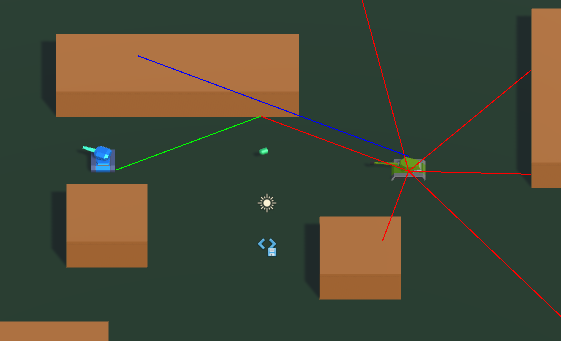

Esta imagen es similar pero con 2 rebotes en vez de 1.

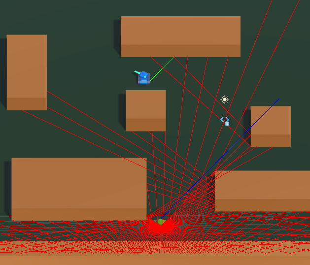

Cabe también destacar que estos raycast empiezan por el lado contrario al jugador, y siempre se coge el primero que se encuentra, de tal forma que el francotirador prefiere (de forma general) tiros largos con varios rebotes a tiros más directos, como se puede apreciar en la imagen de los 2 rebotes, en la que los rayos dibujados (y por tanto calculados) son los que se encuentran al lado contrario al jugador. También se aprecia bien en esta otra captura, en la que existe línea de visión directa entre ambos tanques, pero la dirección escogida es una que emplea los (3) rebotes para llegar al jugador.

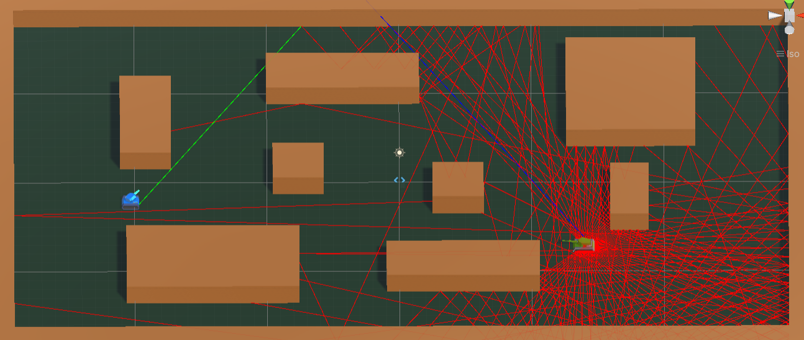

---
## Comunicación
### Sincronización
Cuando un tanque esté listo para disparar, se lo comunicará a los demás. Para esta demo hemos decidido que los tanques sólo disparen al jugador cuando dos de ellos puedan hacerlo a la vez, simulando así las estrategias usadas en shooters tácticos (no puedes apuntar a dos enemigos a la vez, así que mejor que huyas y evites el enfrentamiento).

Para coordinar el momento del disparo, los tanques comunican cuánto tardarán en realizar el disparo, así el francotirador podrá esperar a que el espía salga de su cobertura por ejemplo. Puede haber imprecisiones porque no podemos estimar la velocidad de giro ni tener en cuenta la aceleración o frenada, sólo podemos imaginar que el camino por recorrer está en línea recta. Aún así el funcionamiento es satisfactorio en muchas situaciones y mejoraría con un algoritmo de estimación más sofisticado.

Para realizar pruebas con la sincronización, podemos editar *Min para atacar* en la variable global del canal, que es el número de tanques que tendrán que estar en posición para coordinar el ataque. Hay que tener en cuenta que el tanque no opera en sincronía, por lo que un mínimo para atacar de 3 solo funcionará en la escena con un espía y dos soldados. Todos los ejecutables han sido compilados con un minimo para atacar de 2.

Aqui podemos observar el funcionamiento esperado (el francotirador dispara desde su posición y el espía sale rápidamente de cobertura)

En la siguiente prueba se han determinado unos puntos de disparo lejanos (y erróneos) para comprobar el correcto funcionamiento de la sincronización
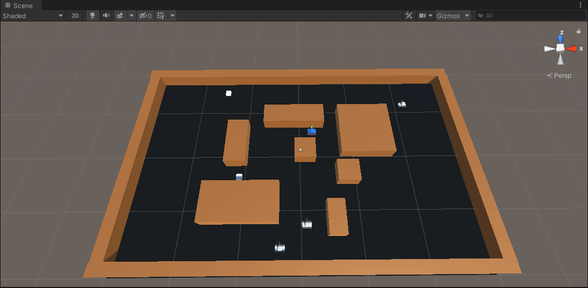
### Peticiones de auxilio
Los agentes podrán pedir ayuda en el canal de comunicación, cambiando un booleano con su ID. Los demás agentes tienen una función para comprobar si alguien (que no sean ellos mismos) necesita ayuda. Podremos implementar tanto IAs que defiendan a sus compañeros por encima de todo como IAs más egoistas que ni siquiera tengan en cuenta esta información.

Actualmente sólo se puede pedir ayuda de forma artificial pulsando la tecla M, activando manualmente el booleano de auxilio. En la siguiente prueba podemos comprobar cómo cuando el tanque de abajo a la izuquierda pide ayuda (vemos la bolita roja) el espía cambia su comportamiento y pasa a atacar continuamente.
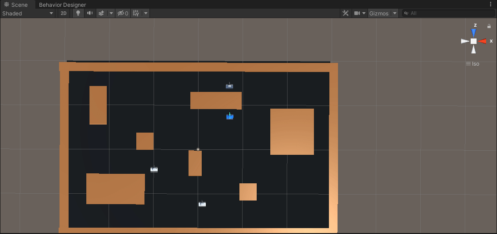

---

### Posibles problemas
Si los tanques no se mueven en el editor, leer el siguiente párrafo

Al haber problemas para guardar variables globales con Behavior Desginer hemos tenido que automatizar el proceso con isTankTarget e isSquadMember. El primero para el jugador y el segundo para la IA (el id de squadMember debe coincidir con el ID de la variable del árbol de comportamiento). Todo esto está automatizado y funcionando, pero en caso de que no sea así habrá que ajustar manualmente las variables globales de Behavior Designer de esta forma para  *EscenaFinalMapaAlternativo* y *EscenaFinal2Soldados* respectivamente.

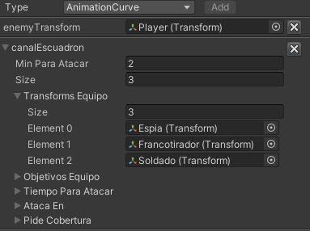
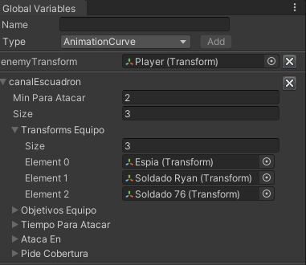