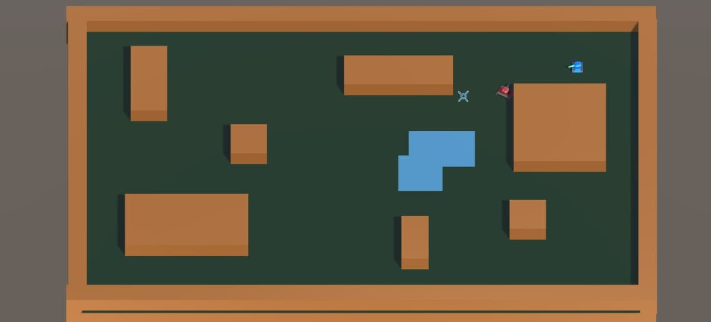

# Carros de Combate
## Objetivo
El objetivo de esta demo es crear un equipo de agentes inteligentes (tanques) que compartan información y se sincronicen sin la necesidad de una IA multinivel.
---
## El mapa
Hemos creado un mapa sencillo con cubos, tanto por estética como por rendimiento de los raycast. Al ser un entorno tan sencillo, podemos ser más laxos a la hora de utilizar raycast.

Tendremos muros (cobre) que actúan como obstáculos y fosos (azules) que impiden el movimiento pero permiten disparar por encima de ellos.

El mapa cuenta con un NavMesh para que los tanques puedan desplazarse sin problema.

## El equipo
Todos los comportamientos están implementados mediante árboles de comportamiento ajustados a sus personalidades.
### El espía
A la hora de flanquear, calcularemos el centro del resto del equipo, aunque podemos excluir a ciertos miembros. Esto significa que a mayor escala podríamos tener varios espías que para este cálculo de flanqueo sólo toman en cuenta a los soldados. 

Tras calcular el centro del equipo con la información que nos proporcionan, elegiremos un punto en dirección opuesta desde donde estemos escondidos (no haya línea de tiro). Seleccionando GameObject del espía, en la vista de escena tendremos visión de la información de dónde se va a esconder.

### El francotirador
El francotirador busca la línea de visión más larga con respecto al jugador

### El soldado

---
## Comunicación
### Sincronización
Cuando un tanque esté listo para disparar, se lo comunicará a los demás. Para esta demo hemos decidido que los tanques sólo disparen al jugador cuando dos de ellos puedan hacerlo a la vez, simulando así las estrategias usadas en shooters tácticos (no puedes apuntar a dos enemigos a la vez, así que mejor que huyas y evites el enfrentamiento).

Para coordinar el momento del disparo, los tanques comunican cuánto tardarán en realizar el disparo, así el francotirador podrá esperar a que el espía salga de su cobertura por ejemplo. Puede haber imprecisiones porque no podemos estimar la velocidad de giro ni tener en cuenta la aceleración o frenada, sólo podemos imaginar que el camino por recorrer está en línea recta. Aún así el funcionamiento es satisfactorio en muchas situaciones y mejoraría con un algoritmo de estimación más sofisticado.

Aqui podemos observar el funcionamiento esperado (el francotirador dispara desde su posición y el espía sale rápidamente de cobertura)

En la siguiente prueba se han determinado unos puntos de disparo lejanos (y erróneos) para comprobar el correcto funcionamiento de la sincronización

### Peticiones de auxilio
Los agentes podrán pedir ayuda en el canal de comunicación, cambiando un booleano con su ID. Los demás agentes tienen una función para comprobar si alguien (que no sean ellos mismos) necesita ayuda. Podremos implementar tanto IAs que defiendan a sus compañeros por encima de todo como IAs más egoistas que ni siquiera tengan en cuenta esta información.

Actualmente sólo se puede pedir ayuda de forma artificial pulsando la tecla M, activando manualmente el booleano de auxilio. En la siguiente prueba podemos comprobar cómo cuando el tanque de abajo a la izuquierda pide ayuda (vemos la bolita roja) el espía cambia su comportamiento y pasa a atacar continuamente.
