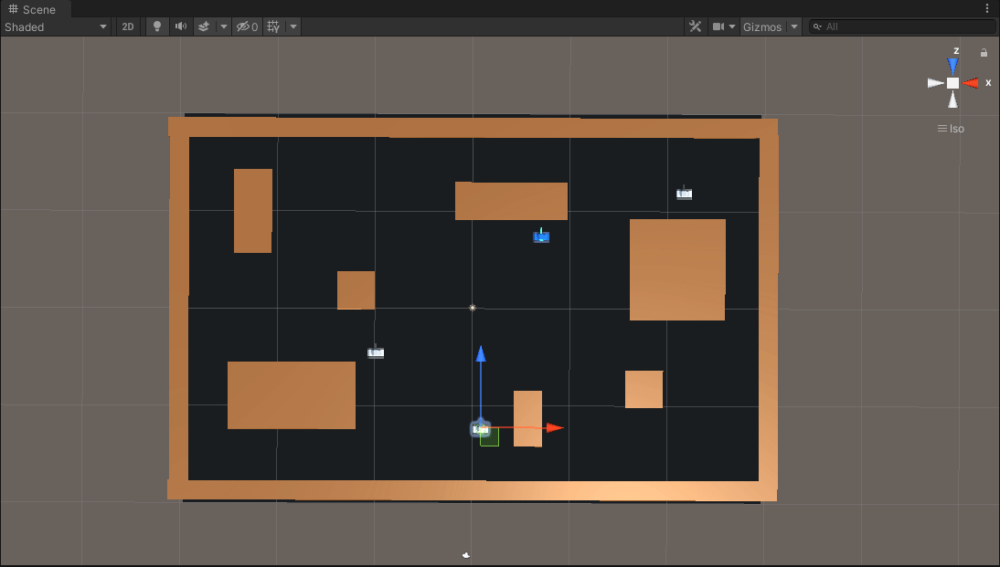

# Carros de Combate
## Objetivo
El objetivo de esta demo es crear un equipo de agentes inteligentes (tanques) que compartan información y se sincronicen sin la necesidad de una IA multinivel.
---
## El equipo
### El espía
A la hora de flanquear, calcularemos el centro del resto del equipo, aunque podemos excluir a ciertos miembros. Esto significa que a mayor escala podríamos tener varios espías que para este cálculo de flanqueo sólo toman en cuenta a los soldados.

Tras calcular el centro del equipo con la información que nos proporcionan, elegiremos un punto en dirección opuesta desde donde estemos escondidos (no haya línea de tiro)

### El francotirador
El francotirador busca la línea de visión más larga con respecto al jugador

### El soldado

---
## Comunicación
### Sincronización
Cuando un tanque esté listo para disparar, se lo comunicará a los demás. Para esta demo hemos decidido que los tanques sólo disparen al jugador cuando dos de ellos puedan hacerlo a la vez, simulando así las estrategias usadas en shooters tácticos (no puedes apuntar a dos enemigos a la vez, así que mejor que huyas y evites el enfrentamiento).

Para coordinar el momento del disparo, los tanques comunican cuánto tardarán en realizar el disparo, así el francotirador podrá esperar a que el espía salga de su cobertura por ejemplo. (puede haber imprecisiones porque no podemos estimar la velocidad de giro, sólo podemos imaginar que el camino por recorrer está en línea recta)

Aqui podemos observar el funcionamiento esperado (el francotirador dispara desde su posición y el espía sale rápidamente de cobertura)

En el siguiente vídeo se han determinado unos puntos de disparo lejanos (y erróneos) para comprobar el correcto funcionamiento de la sincronización
